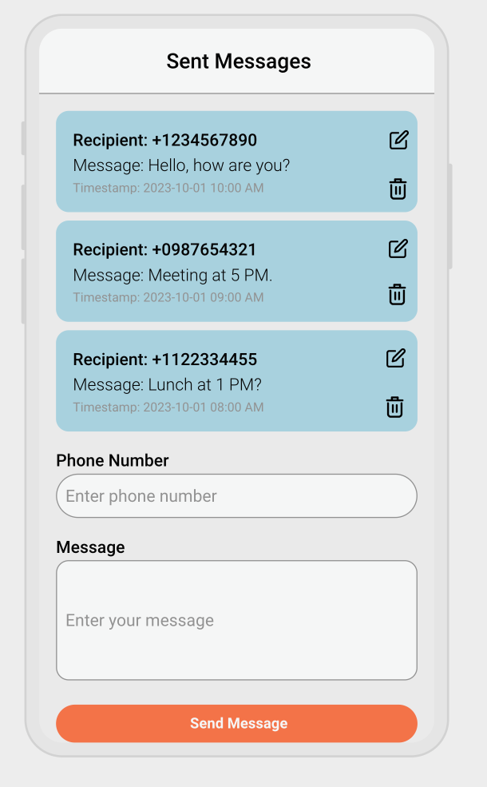

# Kixie Frontend Engineer Takehome

## Objective

This assignment will focus on a vertical slice of web-based SMS messaging system to test your skills with React (using Recoil for state management) and basic CRUD operations. The task is designed to be completed in 3 hours.

## Project Description

You will implement a simple feature where users can:

- Send an SMS message.
- View a list of recently sent messages sorted by ascending timestamp.
- You are required to build the frontend components and integrate the backend api calls for this feature using the technologies specified.
- We've created basic folder for the backend and frontend in this repository. You can use them as a starting point.

### Requirements

- Frontend (React + Recoil):

  - Send SMS Form: A form where users can input:
    - Recipient Phone Number (simple text input)
    - Message Text (text area)
    - Submit button to send the message.
  - Sent Messages List: After a message is sent, the form should clear, and the sent message should appear in a list above the form showing:
    - Recipient Phone Number
    - Message Text
    - Timestamp (Created At)
    - Updated At Timestamp (if the message is edited)
  - Edit Message by Id: Make sent messages editable inline. Show a save button in place of the edit icon when editing.
  - Delete Message by Id: Add a delete button to each message in the list to delete the message. Add a confirmation dialog to confirm the action before deleting the message.
  - Recoil State Management: Use Recoil to manage the state of the form and the list of sent messages locally.

- Backend Integration: You need to integrate following backend endpoints in the backend folder which runs on `localhost:3001` (to run it, you can use `npm run start` in the backend folder):
  - POST /messages - An endpoint that handles creating the message, you can assume the sending of text message occurs in another service and you only need to integrate the api call. The JSON body takes in `recipientPhone` and `messageText` as body parameters.
  - GET /messages - An endpoint that returns a list of all sent messages ordered by descending timestamp.
  - PUT /messages/:id - An endpoint that updates the message with the given id. The JSON body takes in `messageText` as body parameters.
  - DELETE /messages/:id - An endpoint that deletes the message with the given id.

## Technical Requirements

### Frontend

- React for the UI.
- The mockup to follow is as shown below:

- Recoil for managing the state of the form and list of messages.
- Basic styling (focus on functionality, not design). Feel free to use tailwind, chakra, or any other CSS framework if you want to use one.
  - Sent messages should be displayed in a list above the form and their background color should be #add8e6.
  - Be sure to use an appropriate amount of padding and margin to make the message list UI viewable.
- Basic Input validation for the phone number following E.164 format.
  - Invalid phone number should show an error message on the frontend.
  - You may use a any library to validate the phone number.
- Error handling (e.g., failed message submission).

## Additional Questions (You can write your solution in-line in this README.md in text format)

- How would you integrate an auth layer for the application? What additional considerations would you need to make?
  - For a simple login function - integrate an Auth context and provider which tracks whether a user is logged in or not, and restricts access to areas of the site if they are not, JSON web tokens for authentication
  - For more complex requirements, utilise a library such as auth0 which can have integrations with other auth providers, social login etc
  - Considerations: user experience (simple flow with clear feedback, not requiring login too often that it becomes an irritation, other essential functions such as password recovery), security (user passwords not stored in plain text, storing other sensitive information, data protection regulations, protecting data transmitted between the app and the api)
- How would you handle receiving real-time messages if the requirement was added to the project?
- Implement web sockets. In collaboration with the backend team, who would need to create a socket.io server, then on the frontend implement a socket client which listens for messageReceived events to update the recoil state. Possibly including sound based notifications to alert the user
- How would you modify the application to group messages by recipient?
  - Parse the GET messages response using array prototype methods to create a new object indexed on the phone number, each of which contains an array of messages from that number
  - Modify the UI to show a list of recipients first mapping over the new Object.keys, and onClick either change the view to show those messages or have the initial list be an accordion which expands to show the messages
  - NB. the parsing is a backup option - first suggested course of action would be to have the backend modified to return the indexed object instead - faster than parsing (potentially large) arrays on the frontend!

## Submission Instructions

- Please zip the project and send it to us via email. (make sure to exclude or delete the node_modules folder in both the `backend` and `frontend` folders before zipping).
  Update this README to explain any assumptions or design decisions made.

## Time Management Tips

- Focus: Keep the scope small to fit within the 3-hour limit. Focus on getting the core functionality working rather than polishing UI or adding extra features.

## Comments

### Assumptions

- Using MaterialUI as a component base is acceptable - speeds up development and provides tried-and-tested functional components already optimised for accessibility and usability
- Building for scalability - have used a folder structure and abstraction philosophy suited to a growing codebase rather than the small app you see here, to show intent of how I would work in a real-world production environment
- Typescript and testing not required. Would normally be a strong advocate for stringent testing practices in production environments to catch bugs and unintended visual consequences early, and for the use of typescript to make managing large codebases more developer-friendly, both in clarity of what a component is for, and for instant IDE-based feedback on incorrect types rather than waiting for the browser to complain of endpoints fail
- Loading state not required. For a non-locally running environment where bandwidth is important, I would implement a loading provider that triggers a spinner when api calls are executed and disappears when they return

### Testing

- To simulate api failure and test the error handling, you can simply modify the endpoints temporarily in /frontend/src/services/message.js

### API Issues

- As the edit endpoint does not provide a response, and the edited date is generated on the server, a frontend-generated edit date could be out of sync with this on refetch
